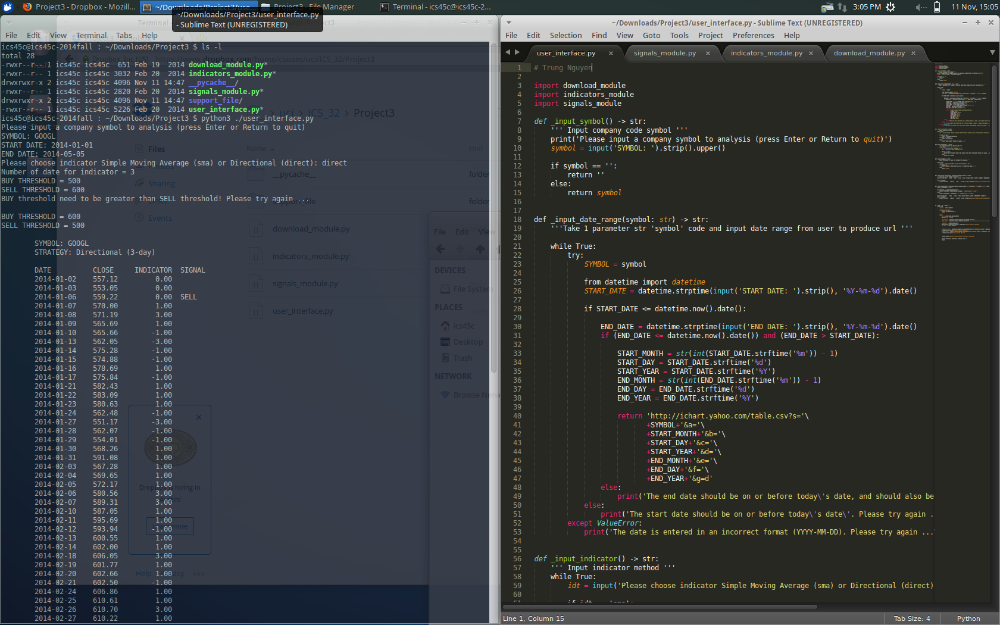
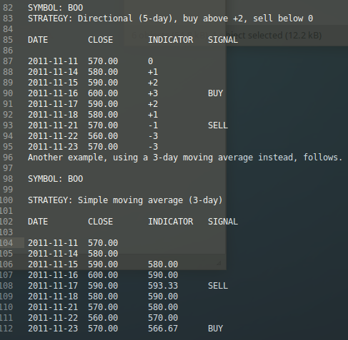

How to run:
==========

On Linux / MacOS / *nix system run command :

$ python3 ./user_interface.py

----------------------------------------

Simple Stock Market Exchange (old school project UCI ICS 32 - Project 3)

This project loads a set of historical stock prices from the Yahoo web server, calculate a few metrics on those prices, and ultimately report on opportune times to buy or sell the stock, based on one of a few buying-and-selling strategies.

Some background on the buying and selling stocks

Stocks that trade on stock exchanges generally have a symbol (sometimes called a ticker symbol) associated with them, which is a shorthand name that is used to uniquely identify a company on that exchange. In the United States, symbols are generally a sequence of uppercase letters; in some parts of the world, digits are also common. For example, the symbol on U.S. stock exchanges for Apple is AAPL, while Google's symbol is GOOG, Microsoft's is MSFT, and Verizon's is VZ.

Yahoo Web Server is an example of a provider of this data. For the most part, daily quotes will tell you the closing price — the final price at which a stock traded on a particular day. The program for this project will derive a few indicators given a sequence of daily quotes.

The start date of the analysis. The user should specify the date in the format YYYY-MM-DD (i.e., a four digit year, followed by a dash, followed by a two-digit month, followed by a dash, followed finally by a two-digit day). So, for example, February 4, 2012 would be specified as 2012-02-04. 
The start date should be on or before today's date; if not, ask the user to specify another.
If the date is entered in an incorrect format (anything other than YYYY-MM-DD), ask the user to specify another.

The end date of the analysis. The user should specify the date in the format YYYY-MM-DD.
The end date should be on or before today's date, and should also be later than the start date; if not, ask the user to specify another.
If the date is entered in an incorrect format (anything other than YYYY-MM-DD), ask the user to specify another.

The signal strategy, which determines the manner in which buy or sell signals will be generated. Show a menu of options to the user and allow one of them to be selected and then configured. The options are listed in the section titled Signal strategies below.
Running the analysis

Indicators

The core of our analysis will be comparing daily prices against the values of indicators. There are two kinds of indicators we'll use:

Simple moving average:
---------------------- 

The N-day simple moving average at the end of a particular day is the average of the most recent N closing prices. Days on which there is no trading are not counted. So, for example, the 10-day simple moving average each day is simply the average of the most recent 10 closing prices. Note that the simple moving average on a particular day includes that day's closing price.

One wrinkle to be aware of here: you need at least N days of prices before you can begin calculating a simple moving average. So the first N - 1 days will not have a simple moving average at all; only on the Nth day are there enough closing prices to report an N-day moving average.

Directional indicator:
----------------------

The N-day directional indicator for a stock is the number of closing prices out of the most recent N on which the stock went up (i.e., it closed at a higher price than the previous close) minus the number of days out of the previous N on which the stock went down (i.e., closed at a lower price than the previous close). It stands to reason, for example, that the 10-day directional indicator will be somewhere between -10 and +10. As with the simple moving average, the directional indicator for a particular day includes that day's closing price.

Unlike simple moving averages, directional indicators are always possible to calculate. In a given report, the first day's indicator value will always be 0, because you don't know whether the stock's move that day was up or down (since you don't have the previous day's price). When there are fewer than N days of prices, you simply calculate the directional indicator using the number of days you have available.
There are many other indicators that are used by those people and programs making buying and selling decisions on stocks, but these are a good start for us.

Signal strategies:
------------------

The main goal of the analysis is to generate buy signals and sell signals, which are recommendations to buy or sell stock at the conclusion of a particular day. There are two strategies, corresponding to the indicators above:

Generate buy and sell signals based on the N-day simple moving average, with the user choosing N (i.e., the number of days). 
Signals are generated as follows:

If the closing price on a particular day has crossed above the simple moving average (i.e., the closing price on that day is above that day's simple moving average, while the previous closing price is not above the previous simple moving average), generate a buy signal.
If the closing price on a particular day has crossed below the simple moving average, generate a sell signal.
Otherwise, generate no signal.

Generate buy and sell signals based on the N-day directional indicator, with the user choosing N (i.e., the number of days) and buy and sell thresholds.

If the directional indicator has crossed above the buy threshold (i.e., the indicator above the buy threshold on that day but is not above the buy threshold on the previous day), generate a buy signal.
If the directional indicator has crossed below the sell threshold, generate a sell signal.
Otherwise, generate no signal.

